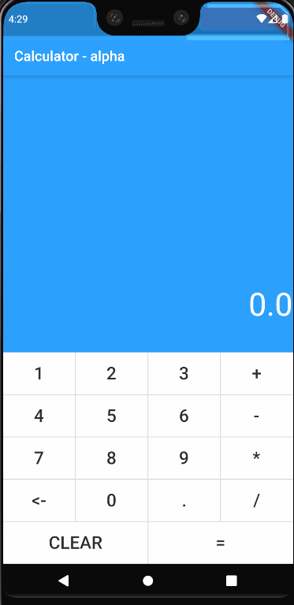

# Calculator

Calculator - Alpha

## Demo

### Getting Started

V0.1 - Alpha
This calculator is built using Flutter.
The implementation for the calculation is a stack data structure. 
The operation entered is converted from an infix form to a postfix form using Stacks and the result is calculated using the obtained postfix expression.

The code is pretty messy, but I hope to make it more efficient and smaller. 
I wish to compress this application's dart files down to 5KB and submit this for Flutter create challenge.